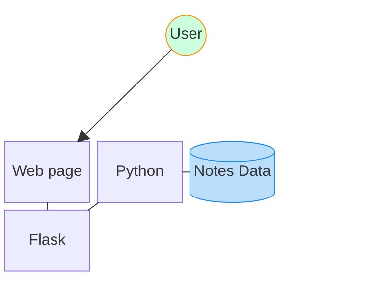

# Pain Point

Different mobiles and computer devices do not contain the same built-in applications for creating new notes or retrieving previous notes, making it especially cumbersome to create and retrieve notes across different networks without utilising third-party services.

## Story and Vision

In last quarter of 2024 while working towards certifications, I became interested in faster note-taking. I started thinking about a quicker way to write my notes to the same place from different devices.

I researched in-built CLI commands such as dialog and zenity, then progressed my initial idea idea to a working command:
```bash
alias noted='zenity --forms --add-entry="Tags" --add-entry="Note" --add-calendar="Due"' | awk -F "|" '\''{print "#"$1"\n\n\n"$2}'\'' > ~/noted/"$(date '\''+%Y-%m-%d_%H-%M-%S'\'' )"'
```

While using the command and continuing along my certifications work, the content I was doing included tutorial examples on containerised Nginx and Python applications.

Mmost of the web applications I had been deploying that year were using Nginx or Apache but when I researched the setup for adding user forms and data storage, I found addons and extensions that can be used.

## Setting Aim

The initial project aims were formed in 2025:
- Design a simple, persistent notes-taking application.
- To be able to use the application from any device.

## Development

Developed the application during 2026 to meet the project aims:

- Selected Python to form simple codebase
- Developed use for browser since all user devices have one installed
- Containerised to provide persistent app storage and increase runtime consistency

Flask had simplest setup to provide Python with web functions

## The Tech Stack



* Python processes web request data to build notes files
* Flask renders HTML pages and request data from endpoints

## The Inner Core

Python application code transforms variables and handles files and folders with simple os library and flask package functions.

## The Challenges

# What to write, what to write...

Once getting the form working and posting first note, when pressing 'Back' could see the previous note again and had to clear it out each time. Also blank boxes loaded to greet user and made experience feel empty. Settled on adding a dedicated button to save a new note and some guiding text in the fields to ensure the experience is continuous and repeatable.

# Don't write that, don't write that...

After outputting the first files by transposing the user input directly into the filenames, I saw some filenames that were much longer than other files on the computer. I realised there could be unexpected results for filenames exceeding the host's filesystem limits, so added extra application code that would trim input where required. This meant that some of the input could potentially be trimmed away so used the tag line to persist the data. The tags line was standard across files and I scripted a sorting function to sort the notes into folders labelled by knowledge category.

# Building an image

I ran into beginner troubles when first publishing the image successfully to docker as I had used docker CLI commands from an arm64 device running on arm32 OS image. When I ran the built image on an amd64 device, I noticed either the app wasn't building or built but then container stayed in 'pending' status. I soon realised I needed to upgrade the device to arm64. Once on arm64, then I learnt about adjusting build architecture options to ensure amd64 images were built by the docker CLI command.

My CI pipelines for the application would package images with commit tags and then 'latest' tags automatically. When I compared it with the image I had built from the CLI commands, I found out the 'latest' image was building without flask or other dependencies. While I knew it was normal that files from one job's workspace are not available in the next job's workspace, the python environment's record of installed packages was available to pip and so it skipped the packages silently. An option was added pip command to force a fresh install each time.

## The Limitations

* Information entered is currently in plaintext and unencrypted.
* There is no user authentication mechanism included.

## The Deployment

When composing with a rootless user account, deploy with or without the environment variable included.
```bash
NOTED_FLASK_PORT=8765 podman-compose up
```
Leaving the variable out will expose port 8080.
```bash
podman-compose up
```

---

Written by Lachlan Christie.

Refer back to the [LICENSE](../../LICENSE).
